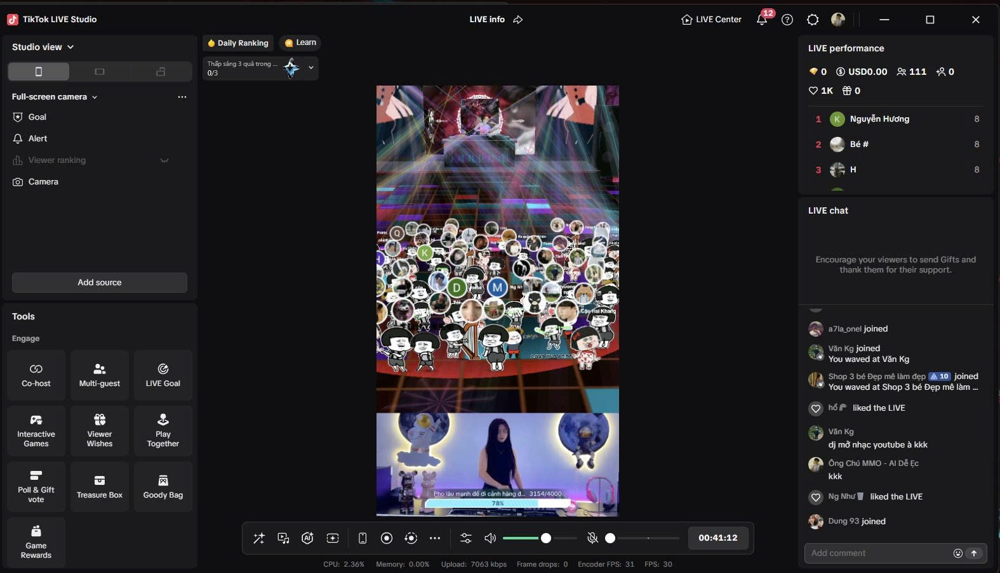

# 🎵 wangnguen-brigde — TikTok Live 3D Dance Floor

[](LICENSE)
[](https://rustup.rs/)
[](https://unity.com/)

**Biến phiên TikTok LIVE thành sàn nhảy 3D tương tác** — Người xem gửi gift, chat, like, follow sẽ xuất hiện trên sàn nhảy với avatar TikTok thật, hiệu ứng ánh sáng, DJ booth và pháo hoa.

---

## 🎬 Video demo thực tế

[](https://www.facebook.com/100004611824062/videos/pcb.3562459197251106/37620662724214707)

> Nhấn vào ảnh để xem video demo đầy đủ trên Facebook.

---

## ✨ Tính năng

- 🕺 **Sàn nhảy 3D realtime** — Người xem TikTok tham gia sàn nhảy với nhân vật 3D
- 👥 **20 NPC thường trực** — Chọn ngẫu nhiên từ 1.520 tên, không trùng trong cùng nhóm; vẫn ở lại khi người thật tham gia. Sàn hỗ trợ thêm tối đa 400 người thật.
- 🎁 **Gift → Hiệu ứng** — Mỗi gift kích hoạt hiệu ứng riêng (zoom camera, pháo hoa, VIP spotlight...)
- 🏆 **TOP 3 điểm** — 1 tim = 1 điểm, 1 kim cương quà = 100 điểm. Bảng nhỏ ở góc dưới phải, có animation đổi hạng; chưa có điểm thì để trống. Thứ hạng trên bục DJ theo cùng bảng điểm.
- 🎵 **DJ Booth** — Phát nhạc + video nền tùy chỉnh
- ⚙️ **Master Rules** — Tùy chỉnh luật game qua giao diện web, không cần code
- 🧪 **Test Lab** — Demo mode với người xem giả để test trước khi live
- 🎨 **Chroma Key** — Bấm F2 để bật nền xanh, ghép vào OBS dễ dàng

---

## 📋 Yêu cầu hệ thống

| Phần mềm | Phiên bản |
|-----------|-----------|
| **Hệ điều hành** | Windows 10 / 11 (64-bit), hoặc macOS 12 trở lên |
| **Rust** | Chỉ cần khi tự build source; ≥ 1.85 ([rustup](https://rustup.rs/)) |
| **Unity** | Chỉ cần khi tự build source; dùng đúng 6000.2.10f1 |
| **TikFinity Desktop** | Chỉ cần khi dùng `LIVE_PROVIDER=tikfinity` |
| **OBS Studio** | Khuyến nghị cho streaming |

> Gói phát hành **không cần cài gì thêm** — server là một file binary đơn lẻ,
> không còn phụ thuộc Node.js như các bản trước. Bản macOS là Universal, chạy
> được cả Apple silicon lẫn Intel.

---

## 🚀 Cài đặt & Chạy

### Cách nhanh nhất trên Windows

1. Tải file `WangnguenBrigde-Live-Windows-v*.zip` mới nhất ở mục [**Releases**](https://github.com/cherry9001/tiktok-live-bar/releases/latest).
2. Giải nén toàn bộ ZIP ra một thư mục mới. Không chạy trực tiếp bên trong ZIP.
3. Nhấp đúp `run.bat`. Launcher tự mở Server, Game và Control Panel.

### Dấu hiệu cài đặt thành công

Sau khi chạy `run.bat` lần đầu:

- Cửa sổ **TikTok Server** hiển thị địa chỉ `http://127.0.0.1:8085`.
- Trình duyệt mở Control Panel và logo wangnguen-brigde hiển thị bình thường.
- Game mở và báo kết nối server thành công.
- Gói Windows đã kèm `Build/DJ_MUSIC/nhacnen.MP3`; có thể thay bằng MP3/WAV/OGG của bạn.

Lần chạy đầu tiên launcher tự tạo `Server\.env` từ `Server\.env.example`.

> `run.bat` không tự tắt chương trình khác đang dùng cổng 8085. Nếu launcher báo
> xung đột cổng, hãy đóng đúng chương trình được báo rồi chạy lại để tránh mất dữ liệu.

> **Không tải “Source code (zip)” nếu bạn chỉ muốn chơi.** File source tự động của
> GitHub không chứa thư mục `Build`; hãy tải đúng file Windows ở mục Releases.

### Cách nhanh nhất trên macOS

1. Tải file `WangnguenBrigde-Live-macOS-v*.zip` mới nhất ở mục [**Releases**](https://github.com/cherry9001/tiktok-live-bar/releases/latest).
2. Giải nén toàn bộ ZIP ra một thư mục mới.
3. Mở Terminal tại thư mục vừa giải nén, chạy **đúng một lần**:

   ```bash
   xattr -dr com.apple.quarantine .
   ```

4. Nhấp đúp `run.command`.

> Bản macOS **chưa được ký số** vì dự án không có tài khoản Apple Developer, nên
> Gatekeeper chặn lần đầu mở. Bước 3 gỡ cờ quarantine. Nếu bỏ qua bước đó, macOS
> sẽ báo "không mở được vì chưa rõ nguồn gốc" — vào **System Settings → Privacy &
> Security**, kéo xuống bấm **Open Anyway** rồi thử lại. Chi tiết nằm trong file
> `DOC-TRUOC-KHI-CHAY.txt` đi kèm gói.

Thả nhạc và video vào hai thư mục `DJ_MUSIC` và `DJ_VIDEO` nằm cạnh `run.command`.
Trên macOS game đọc media từ bên trong `TikTokBarGame.app`, nên hai thư mục đó
thực ra là symlink trỏ vào bundle — bạn không cần mở "Show Package Contents".

### Dành cho lập trình viên — Clone source

```bash
git clone https://github.com/cherry9001/tiktok-live-bar.git
cd tiktok-live-bar
```

Source GitHub không chứa game đã biên dịch. Cài [Rust](https://rustup.rs/) và Unity
`6000.2.10f1`, sau đó chạy `build.bat`.

### Build thủ công — một lệnh ra trọn gói phát hành

```bat
build.bat
```

`build.bat` làm tuần tự 3 việc:

| Bước | Việc | Kết quả |
|---|---|---|
| 1 | `cargo build --release` | `server\target\release\tiktok-server.exe` |
| 2 | Unity batchmode build | `Build\TikTokBarGame.exe` |
| 3 | `scripts/package-windows.sh` | `dist\WangnguenBrigde-Live-Windows-v<version>.zip` |

Bước 3 cần Git Bash (đi kèm Git for Windows). Nếu chỉ muốn đóng gói lại từ bản
build có sẵn thì chạy riêng:

```bash
bash scripts/package-windows.sh
```

Đặt biến `VERSION` để ghi đè số phiên bản trong tên file ZIP; nếu không, script lấy
theo tag git trên HEAD, rồi mới đến `bundleVersion` trong `ProjectSettings.asset`.

### Chạy server thủ công khi phát triển

```bash
cd server
cp .env.example .env
cargo run
```

### Mở Control Panel

Truy cập [http://127.0.0.1:8085/control.html](http://127.0.0.1:8085/control.html) trên trình duyệt.

### Kết nối TikTok LIVE

- **`LIVE_PROVIDER=tiktok`** (mặc định trong `.env.example`) — nối thẳng TikTok,
  không cần API key. Nhập username TikTok đang live vào Control Panel → **Kết nối**.
- **`LIVE_PROVIDER=tikfinity`** — đường lui: mở TikFinity Desktop → đăng nhập →
  bật LIVE, rồi kết nối như trên.

---

## 📁 Cấu trúc thư mục

```
├── server/                # Rust + Axum backend — bridge TikTok ↔ Unity
│   ├── src/               # domain / live / session / transport
│   ├── config/            # Cấu hình game, gifts, master rules
│   ├── public/            # Control panel (HTML/JS/CSS)
│   └── vendor/            # piratetok-live-rs đã patch cho Windows
│
├── TikTokBridge/          # Bản Node.js cũ — giữ làm đường lui khi phát triển,
│   └── assets/            # không còn nằm trong gói phát hành. Banner, GIF hiệu ứng.
│
├── UnityProject/          # Unity 6 — Game 3D
│   ├── Assets/Scripts/    # C# scripts (24 files)
│   └── Assets/Editor/     # Editor tools & build script
│
├── DJ_MUSIC/              # 🎵 Thả file nhạc MP3/WAV/OGG vào đây
├── DJ_VIDEO/              # 🎬 Thả file video MP4/PNG vào đây
├── LiveAssets/            # Hình nền, GIF hiệu ứng
├── Build/                 # Output Unity; không có trong source Git
├── dist/                  # Output đóng gói; không có trong source Git
│
├── scripts/
│   └── package-windows.sh # Gộp game + server thành 1 file ZIP phát hành
├── build.bat              # Build server + game, rồi đóng gói
├── run.bat                # Chạy server + game
├── LICENSE                # Giấy phép MIT
└── README.md              # File này
```

Bố cục bên trong gói phát hành:

```
WangnguenBrigde-Live-Windows-v<version>/
├── run.bat
├── Build/                 # Game Unity + DJ_MUSIC + DJ_VIDEO
└── Server/                # tiktok-server.exe + config/ + public/ + assets/
```

---

## ⌨️ Phím tắt trong Game

| Phím | Chức năng |
|------|-----------|
| `F1` | Ẩn / hiện bảng điều khiển |
| `F2` | Bật / tắt nền xanh Chroma Key |
| `F3` | Ẩn / hiện bảng TOP điểm |
| `F11` | Toàn màn hình |

---

## 💬 Lệnh chat người xem

| Lệnh | Hiệu ứng |
|-------|-----------|
| `nhảy` / `dance` | Nhân vật nhảy |
| `đi vòng` / `walk` | Nhân vật đi bước tại chỗ |
| `đổi nv` | Đổi nhân vật ngẫu nhiên |

---

## 🎁 Hệ thống Gift

| Mức gift | Kim cương | Hiệu ứng |
|----------|-----------|-----------|
| Gift nhỏ | 1–9 💎 | Nhân vật nhảy, vào sàn |
| Gift trung | 10–99 💎 | Zoom camera, đổi nhân vật |
| Gift VIP | 100+ 💎 | Spotlight, pháo hoa, top DJ |

> Tùy chỉnh qua **Master Rules** trong Control Panel → tab ⚙️ Master Rules.

---

## 🎵 Thêm nhạc & video

- **Nhạc nền DJ:** Thả file `.mp3`, `.wav`, `.ogg` vào thư mục `DJ_MUSIC/`
- **Video nền:** Thả file `.mp4`, `.mov`, `.webm` hoặc ảnh `.png`, `.jpg` vào `DJ_VIDEO/`
- Game tự phát lặp và tắt tiếng video

> ⚠️ Hãy sử dụng nhạc và video có bản quyền hợp lệ.

---

## 🔧 Tùy chỉnh nâng cao

### Master Rules (không cần code)

Mở Control Panel → tab **⚙️ Master Rules** để:
- Thêm/sửa luật: Gift nào → hiệu ứng gì
- Chọn chế độ tham gia sàn (chat keyword hoặc mọi tương tác)
- Bật/tắt tự động vào sàn khi tặng gift

### Cấu hình Server

Sửa file `Server/.env` (trong gói phát hành) hoặc `server/.env` (khi chạy source):

```env
HOST=127.0.0.1
PORT=8085
LIVE_PROVIDER=tiktok
TIKFINITY_WS_URL=ws://127.0.0.1:21213/
```

Server nạp file `.env` khi khởi động; biến môi trường của Windows được ưu tiên nếu
cùng tên. Bản game dựng sẵn kết nối cố định tới cổng `8085` — chỉ đổi `PORT` khi bạn
dùng riêng Control Panel hoặc đã sửa `serverUrl` trong
`UnityProject/Assets/Scripts/TikTokWebSocketClient.cs` rồi build lại Unity client.

### Xử lý lỗi cài đặt thường gặp

- **Không tìm thấy `tiktok-server.exe`:** bạn chưa giải nén hết ZIP, hoặc đang chạy source mà chưa chạy `build.bat`.
- **Cổng 8085 đang bị chiếm:** đóng đúng ứng dụng/PID được launcher báo; launcher không tự tắt ứng dụng khác.
- **Không tìm thấy game:** bạn đã tải Source ZIP hoặc clone Git. Hãy tải bản Windows trong Releases hoặc tự build bằng Unity.
- **Windows SmartScreen cảnh báo:** chọn **More info → Run anyway** nếu file được tải từ Release chính thức của repo này.
- **TikTok chưa có sự kiện:** mở TikFinity, kiểm tra WebSocket `ws://127.0.0.1:21213/`, sau đó thử **Test Lab** trước.

---

## 🧪 Test

```bash
cd server
cargo test
```

Hoặc dùng **Test Lab** trong Control Panel để tạo người xem giả.

---

## 📺 Ghép vào OBS

1. Thêm source **Game Capture** → chọn cửa sổ wangnguen-brigde Live
2. Bấm **F2** trong game để bật Chroma Key (nền xanh)
3. Trong OBS: thêm filter **Chroma Key** → chọn màu xanh

---

## 📜 Giấy phép

Dự án được phát hành theo [Giấy phép MIT](LICENSE).

Tài nguyên bên thứ ba (GIF, hình ảnh) có thể có giấy phép riêng — xem `sources.json` trong từng thư mục assets.

---

## 📞 Liên hệ

- 📧 Email: wangnguenlc79@gmail.com
- 💻 Mã nguồn: [github.com/ducphanvanntq/tiktok-live-app](https://github.com/ducphanvanntq/tiktok-live-app)

---

<p align="center">
  Made with ❤️ by <strong>wangnguen-brigde</strong>
</p>
